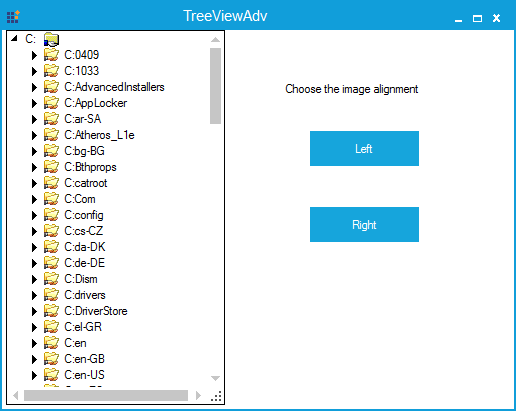

# How to set the images for treeview nodes in the WinForms TreeViewAdv?

In [WinForms TreeViewAdv](https://www.syncfusion.com/winforms-ui-controls/treeview) control can be customized with images to the Left or Right side of its [TreeNodeAdv](https://help.syncfusion.com/cr/windowsforms/Syncfusion.Windows.Forms.Tools.TreeNodeAdv.html). The images can be set on the Left or Right by using the properties [LeftImageList](https://help.syncfusion.com/cr/windowsforms/Syncfusion.Windows.Forms.Tools.TreeViewAdv.html#Syncfusion_Windows_Forms_Tools_TreeViewAdv_LeftImageList) and [RightImageList](https://help.syncfusion.com/cr/windowsforms/Syncfusion.Windows.Forms.Tools.TreeViewAdv.html#Syncfusion_Windows_Forms_Tools_TreeViewAdv_RightImageList). It is also possible to specify different images for the individual nodes by using the [LeftImageIndices](https://help.syncfusion.com/cr/windowsforms/Syncfusion.Windows.Forms.Tools.TreeNodeAdv.html#Syncfusion_Windows_Forms_Tools_TreeNodeAdv_LeftImageIndices) and [RightImageIndices](https://help.syncfusion.com/cr/windowsforms/Syncfusion.Windows.Forms.Tools.TreeNodeAdv.html#Syncfusion_Windows_Forms_Tools_TreeNodeAdv_RightImageIndices) properties in the [TreeNodeAdv](https://help.syncfusion.com/cr/windowsforms/Syncfusion.Windows.Forms.Tools.TreeNodeAdv.html).

**C#**
```csharp
//Assigns image list to the TreeNodeAdv.
this.treeViewAdv1.LeftImageList = this.imageList1;
this.treeViewAdv1.RightImageList = this.imageList1;
 
//Gets the Path of the node and AddSeparatorAtEnd property set to true.
string path = e.Node.GetPath("\\");
 
//Gets an Array of Directories from the current directory path.
ArrayList dirs = new ArrayList(Directory.GetDirectories(path));
 
//Adds the Directories as a node in the TreeViewAdv
for (int i = 0; i < dirs.Count; i++)
{
    string dir = (string)dirs[i];
    int lastIndex = dir.LastIndexOf("\\") + 1;
    TreeNodeAdv node = new TreeNodeAdv(dir.Substring(lastIndex));
    e.Node.Nodes.Add(node);
    node.RightImageIndices = new int[] { 1 };
}
 
//Sets the Left images for the TreeNodeAdv.
foreach (TreeNodeAdv node in this.treeViewAdv1.Nodes[0].Nodes)
{
    node.LeftImageIndices = new int[] { 1 };
    node.RightImageIndices = new int[] { -1 };
}
 
//Sets the Right images for the TreeNodeAdv.
foreach (TreeNodeAdv node in this.treeViewAdv1.Nodes[0].Nodes)
{
    node.RightImageIndices = new int[] { 1 };
    node.LeftImageIndices = new int[] { -1 };
}
```

**VB.Net**
```vbnet
' Assigns image list to the TreeNodeAdv.
Me.treeViewAdv1.LeftImageList = Me.imageList1
Me.treeViewAdv1.RightImageList = Me.imageList1

' Gets the Path of the node and AddSeparatorAtEnd property set to true.
Dim path As String = e.Node.GetPath("\")

' Gets an Array of Directories from the current directory path.
Dim dirs As New ArrayList(Directory.GetDirectories(path))

' Adds the Directories as a node in the TreeViewAdv.
For i As Integer = 0 To dirs.Count - 1
    Dim dir As String = CStr(dirs(i))
    Dim lastIndex As Integer = dir.LastIndexOf("\") + 1
    Dim node As New TreeNodeAdv(dir.Substring(lastIndex))
    e.Node.Nodes.Add(node)
    node.RightImageIndices = New Integer() { 1 }
Next i

' Sets the Left images for the TreeNodeAdv.
For Each node As TreeNodeAdv In Me.treeViewAdv1.Nodes(0).Nodes
    node.LeftImageIndices = New Integer() { 1 }
    node.RightImageIndices = New Integer() { -1 }
Next node

' Sets the Right images for the TreeNodeAdv.
For Each node As TreeNodeAdv In Me.treeViewAdv1.Nodes(0).Nodes
    node.RightImageIndices = New Integer() { 1 }
    node.LeftImageIndices = New Integer() { -1 }
Next node
```


**Figure 1:** Images aligned on the left side of the TreeNodeAdv


**Figure 2:** Images aligned right side of the TreeNodeAdv

Take a moment to peruse the [WinForms TreeViewAdv -  ImageCustomization](https://help.syncfusion.com/windowsforms/treeview/treenodeadvcustomization#image-customization) documentation, to learn more about image customization with examples.